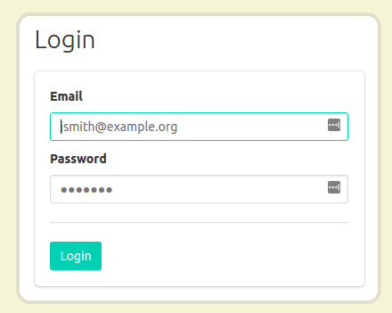
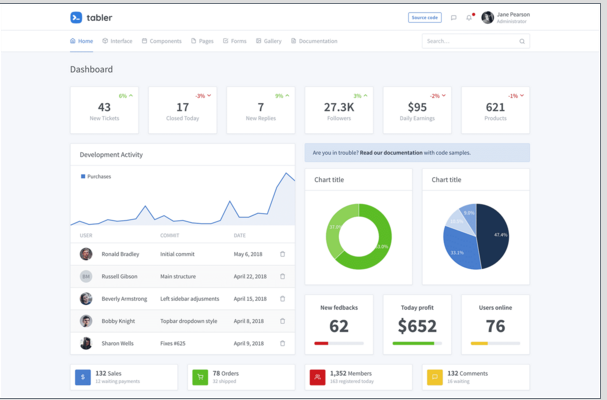

## CSS

#### CSS垂直居中
[http://blog.csdn.net/freshlover/article/details/11579669](http://blog.csdn.net/freshlover/article/details/11579669)

#### LiveStyle
  前端实时可视化工具,chrome网上商店  +liveStyle --sublime
文件和debug双向修改代码，css  less

#### 隐藏滚动条 overscroll-behavior

[https://www.w3cplus.com/css/overscroll-behavior.html](https://www.w3cplus.com/css/overscroll-behavior.html)

#### 打印
[https://lon.im/post/css-print.html](https://lon.im/post/css-print.html)

#### 动画
[HTML5+CSS3 loading 效果收集](https://www.qianduan.net/free-html5-css3-loaders-preloaders/)

[巧用 CSS 动画实现动态气泡背景](https://juejin.im/post/5a903b706fb9a06336116935)

#### CSS Houdini
[https://juejin.im/post/5adc091b51882567105f5586](https://juejin.im/post/5adc091b51882567105f5586)

Chrome 65支持,CSS Houdini只能工作在localhost域名或者是https的环境，否则的话相关API是不可见（undefined）的。如果没有https环境的话，可以装一个http-server的npm包，然后在本地启动，访问localhost:8080就可以了

#### polished.js---CSS in JS 库

[http://www.ruanyifeng.com/blog/2017/04/css_in_js.html](http://www.ruanyifeng.com/blog/2017/04/css_in_js.html)

它将一些常用的 CSS 属性封装成函数，用起来非常方便，充分体现使用 JavaScript 语言写 CSS 的优势。

#### CSS框架
Bulma框架
[http://www.ruanyifeng.com/blog/2017/10/bulma.html](http://www.ruanyifeng.com/blog/2017/10/bulma.html)

最大的特点，就是简单好用。所有样式都基于class，只需为 HTML 元素指定class，样式立刻生效。

tabler [https://github.com/tabler/tabler](https://github.com/tabler/tabler)

一套基于 Bootstrap 4 免费开源的 Dashboard 模版

