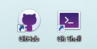

## Git

[廖雪峰的网站-详细Git教程](https://www.liaoxuefeng.com/wiki/0013739516305929606dd18361248578c67b8067c8c017b000)

github客户端-方便代码提交和操作


### 命令总结

>新建仓库

```js
$ git init // 把这个目录变成Git可以管理的仓库,当前目录下多了一个.git的目录，这个目录是Git来跟踪管理版本库的,如果这个目录默认是隐藏的，用ls -ah命令就可以看见
>随便新建一个readme.txt文件
$ git add readme.txt // 添加文件到库
$ git commit -m "wrote a readme file" // 文件提交到仓库
[master (root-commit) eaadf4e] wrote a readme file
 1 file changed, 2 insertions(+)
 create mode 100644 readme.txt

$ git status命令可以让我们时刻掌握仓库当前的状态
```
>修改文件
```js

$ git diff  // 查看文件修改内容
$ git status //看看当前仓库的状态
$ git add
$ git commit
$ git log // 查看历史记录 $ git log --pretty=oneline
```
>回退版本
```js

// 在Git中，用HEAD表示当前版本，上一个版本就是HEAD^，上上一个版本就是HEAD^^,版本太多写成HEAD~100
$ git reset --hard HEAD^ 
或者
$ git reset --hard 1094a（版本号commit id-前几位即可）

// 后悔药：Git提供了一个命令git reflog用来记录你的每一次命令,即可查到commit id
$ git reflog
e475afc HEAD@{1}: reset: moving to HEAD^
1094adb (HEAD -> master) HEAD@{2}: commit: append GPL

```
>分支
```js

$ git branch dev            // 创建dev分支-- git branch命令查看当前分支
$ git checkout dev          // 切换到dev分支 也可用合集 $ git checkout -b dev           
$ git checkout master       // dev分支的工作完成，切换回master分支
$ git merge dev             // 把dev分支的工作成果合并到master分支上
$ git branch -d <name>      // 删除分支
```
注意： 合并分支时，如果可能，Git会用Fast forward模式，删除分支后，会丢掉分支信息。所以要强制禁用Fast forward模式，Git就会在merge时生成一个新的commit，这样，从分支历史上就可以看出分支信息。使用命令：
$ git merge --no-ff -m "merge with no-ff" dev
>冲突
```js
$ git merge feature1
// 修改冲突文件readme.txt,Git用<<<<<<<，=======，>>>>>>>标记出不同分支的内容
// 解决冲突后
$ git add readme.txt 
$ git commit -m "conflict fixed"
```
>bug 分支

修复一个代号101的bug
```js
$ git stash                     // 把当前工作现场“储藏”起来
```
```js
$ git checkout master           // 切换到bug修复分支
$ git checkout -b issue-101     // 创建bug分支

$ git add readme.txt            // 提交
$ git commit -m "fix bug 101"   

$ git checkout master           // 切换到bug修复分支
$ git merge --no-ff -m "merged bug fix 101" issue-101  // 合并--bug修复完成

$ git checkout dev              //切回工作分支
$ git status
$ git stash list                // 查看存储列表
stash@{0}: WIP on dev: f52c633 add merge

$ git stash apply stash@{0}     // 恢复
$ git stash drop  stash@{0}     // 删除存储
```
```js
$ git stash pop                 // 恢复+删除
```
