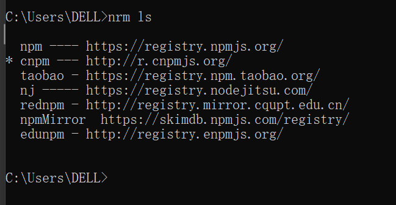

##nrm
::: tip 用nrm一键切换npm源
安装 npm install nrm -g --save
:::

查看默认配置：nrm ls命令，带*号即为当前使用的配置

切换源： nrm use cnpm

添加源：用nrm add 命令添加公司私有npm源，如http://registry.npm.360.org(随便写的)，起个别名叫qihoo

删除源 nrm del qihoo